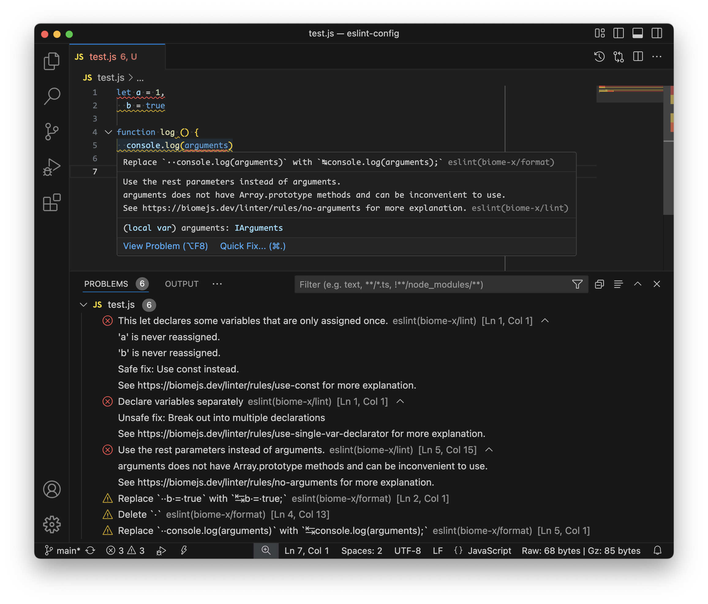

<h1 align="center">eslint-plugin-biome-x</h1>

<p align="center">
  
</p>

<p align="center">
  ESLint + Biome = 💥 <code>eslint-plugin-biome-x</code> 🤯
</p>

## Overview
`eslint-plugin-biome-x` is an ESLint plugin that integrates [Biome](https://biomejs.dev/) with [ESLint](https://eslint.org/).

## Screenshot


## Motivation
While Biome is considered a replacement for ESLint and Prettier, ESLint remains widely used in real-world projects. Many ESLint rules and plugin rules are not yet available in Biome.

It's possible to use both Biome and ESLint in a project when you want to adopt Biome, but this can lead to confusion due to setting up multiple lint processes for CI/Git hooks or multiple linter plugins in the editor.

With `eslint-plugin-biome-x`, you can keep using ESLint and get unified suggestions from Biome through ESLint rules, similar to what `eslint-plugin-prettier` did for Prettier.

## Install
```sh
npm i -D eslint-plugin-biome-x
```

## Usage
We use ESM format to demonstrate the usage, but if your project does not specify `"type": "module"` in its `package.json` file, then the config file must be in CommonJS format.

### Flat config ([`eslint.config.js`](https://eslint.org/docs/latest/use/configure/configuration-files), require ESLint `>=8.56.0`)
```js
import eslintPluginBiomeX from 'eslint-plugin-biome-x'

export default [eslintPluginBiomeX.configs.recommended]
```

### Legacy config ([`.eslintrc.js`](https://eslint.org/docs/latest/use/configure/configuration-files-deprecated), not recommended as it has been deprecated since ESLint 9.0.0)
```js
export default {
  extends: ['plugin:biome-x/recommended-legacy'],
}
```

## Configuration
`eslint-plugin-biome-x` comes with a reasonable default configuration provided by Biome, see [default formatter options](https://biomejs.dev/formatter/#options) and [recommended rules](https://biomejs.dev/linter/rules/#recommended-rules)  of Biome.

If the default configuration doesn't fit your needs, you can configure `eslint-plugin-biome-x` in several ways. Configurations from multiple places will be deeply merged.

- `biome.json` in your project's root directory
- `biome` field in the `package.json`
  ```json5
  {
    "name": "awsome-package",
    "biome": { /** your configuation goes here */ }
  }
  ```
- `settings['biome-x']` field in the ESLint config file
  ```js
  export default [
    {
      settings: {
        'biome-x': {
          biomeConfig: {
            /** your configuation goes here */
          },
        },
      },
    },
  ]
  ```
- Rule options
  ```js
  import eslintPluginBiomeX from 'eslint-plugin-biome-x'

  export default [
    {
      plugins: {
        'biome-x': eslintPluginBiomeX,
      },
      rules: {
        'biome-x/format': [
          'warn',
          {
            /** your configuation goes here */
          },
        ],
        'biome-x/lint': [
          'error',
          {
            /** your configuration goes here and it can be different from above */
          },
        ],
      },
    },
  ]
  ```

You can find the configuration structure in the [Biome configuration reference](https://biomejs.dev/reference/configuration/).

## Rules
💼 Configurations enabled in.\
⚠️ Configurations set to warn in.\
✅ Set in the recommended configuration.\
🔧 Automatically fixable by the --fix CLI option.

| Name | Description | 💼 | ⚠️ | 🔧 |
| :-- | :-- | :-- | :-- | :-- |
| format | Enforce the code to follow the style introduced by `biome format`. | | ✅ | 🔧 |
| lint | Report errors raised by `biome lint`. | ✅ | | |

## Settings
- `biomeConfig`

  Specifies the configuration for Biome. Its structure can be found in the [the configuration reference of Biome](https://biomejs.dev/reference/configuration/).

  Example:
  ```js
  // eslint.config.js
  import eslintPluginBiomeX from 'eslint-plugin-biome-x'

  export default [
    eslintPluginBiomeX.configs.recommended,
    {
      settings: {
        'biome-x': {
          biomeConfig: {
            formatter: { lineWidth: 120 },
            javascript: { formatter: { quoteStyle: 'single' } },
            linter: {
              rules: {
                style: { noDefaultExport: 'error' },
                suspicious: { noConsole: { level: 'error', options: { allow: ['assert'] } } },
              },
            },
          },
        },
      },
    },
  ]
  ```

- `biomeInstance`

  Specifies the Biome instance to be used for linting if you don't want to use the bundled one. If the `biomeInstance` setting is set, the `biomeConfig` setting will be ignored, you have to handle its configuation yourself.

  Example:
  ```js
  // eslint.config.js
  import { Biome } from '@biomejs/js-api'
  import module from '@biomejs/wasm-nodejs'
  import eslintPluginBiomeX from 'eslint-plugin-biome-x'

  const biome = await Biome.create({})
  biome.applyConfiguration({
    /** your custom configuation */
  })

  export default [
    eslintPluginBiomeX.configs.recommended,
    {
      settings: {
        'biome-x': { biomeInstance: biome },
      },
    },
  ]
  ```

- `diagnosticFormatter`

  A function used for formatting [diagnostics](https://biomejs.dev/reference/diagnostics/) reported by Biome as the corresponding ESLint error messages.

  Example:
  ```js
  // eslint.config.js
  import eslintPluginBiomeX from 'eslint-plugin-biome-x'

  export default [
    eslintPluginBiomeX.configs.recommended,
    {
      settings: {
        'biome-x': {
          diagnosticFormatter(diagnostic) {
            return diagnostic.category || 'unknown error'
          },
        },
      },
    },
  ]
  ```

## Downsides
- `eslint-plugin-biome-x` uses [@biomejs/js-api](https://www.npmjs.com/package/@biomejs/js-api) under the hood, which is now a lot slower than running native Biome command.
- As of now, autofix functionality of `biome lint` is not usable when using `eslint-plugin-biome-x`. `eslint-plugin-biome-x` only reports errors raised by Biome.

## Credits
- [@biomejs/js-api](https://github.com/biomejs/biome/tree/main/packages/%40biomejs/js-api)
  We utilize the JavaScript APIs of Biome exposed by this package.
- [eslint-plugin-prettier](https://github.com/prettier/eslint-plugin-prettier)
  The implementation of the format rule is hightly inspired by the source code of eslint-plugin-prettier.

## License
[MIT](license)
